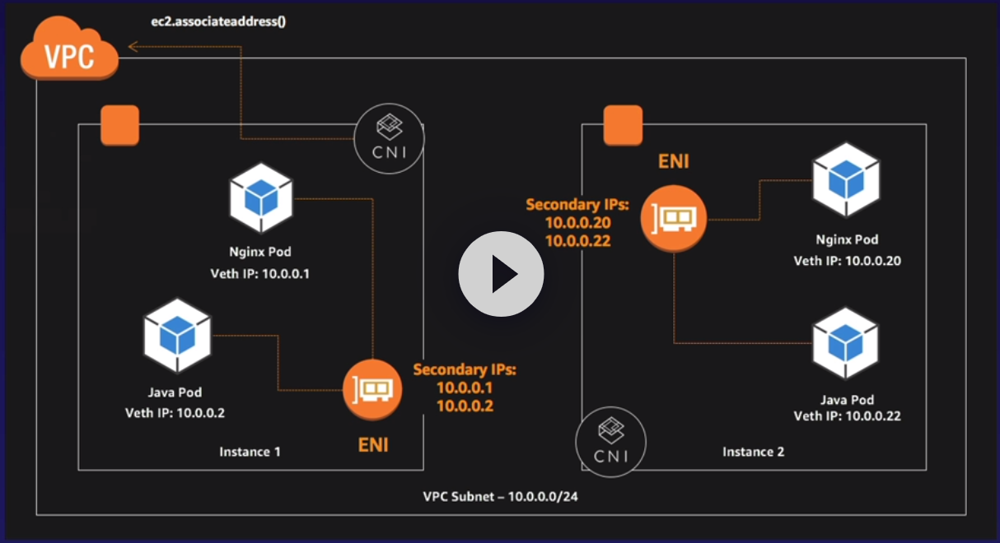
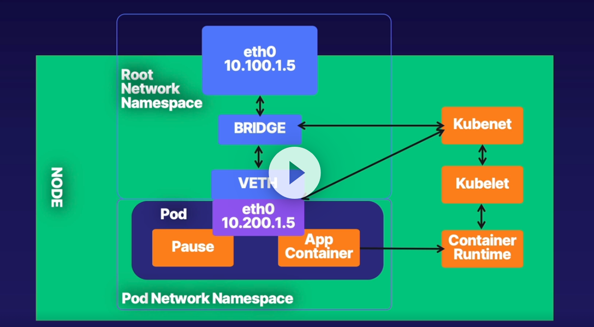
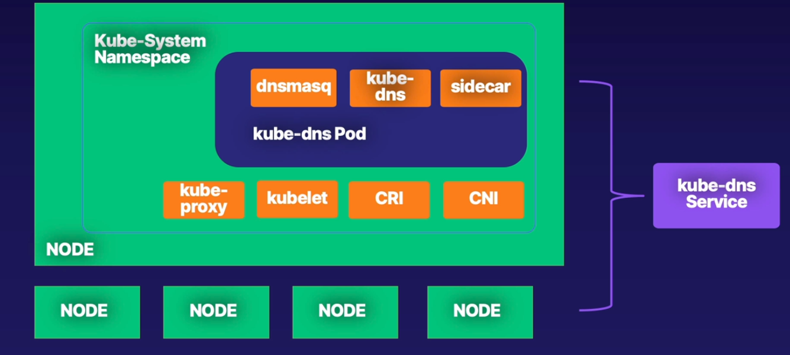

### Course: Advanced-networking-with-for-k8s-aws

### Cluster Networking

- Host Routing
- Cluster Ip
- Private IPs (pod)

### Overlay Network

> Route tables only allows 50 rules

### Cluster DNS

- Run as deployment with replica of 2.
pod
  spc.dnsPolicy: default | ClusterFirst | ClusterFirstWithHostNet | None

